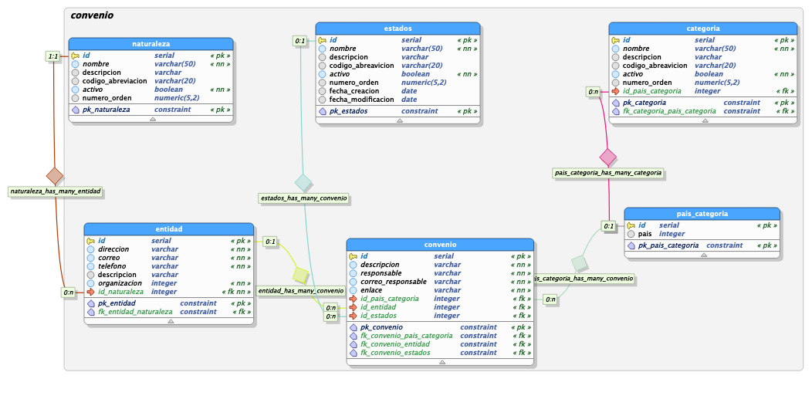

# Convenios CRUD

**convenios_crud**, CRUD para el negocio de convenios en el marco del proyecto Movilidad Académica. El proyecto está escrito en el lenguaje Go, generado mediante el **[framework beego](https://beego.me/)**.

### Modelo de Datos


Sql de la base de datos: **[Convenios BD](https://drive.google.com/file/d/1vf5x8L7vLCJhNGzXEw6h4FiKiUBHmulM/view?usp=sharing)**


# Instalación
Para instalar el proyecto de debe relizar lo siguientes pasos:

## Opción 1

Ejecutar desde la terminal 'go get repositorio':
```shell 
go get https://github.com/udistrital/convenios_crud
```

## Opción 2

1. Clonar en el proyecto en la carpeta local: go/src/github.com/udistrital:
```shell
cd ~go/src/github.com/udistrital 
```

2. Ejecutar:

```shell 
git clone https://github.com/udistrital/convenios_crud
```

3. Ir a la carpeta del proyecto
```shell 
cd convenios_crud
```

4. Instalar dependencias del proyecto:
```shell 
got get
```


# Ejecución del proyecto
Ubicado en la raíz del proyecto,
```shell 
cd ~/go/src/github.com/udistrital/convenios_crud
```

- Ejecutar: 
```shell 
bee run
```
- O si se quiere ejecutar el swager:

```shell 
bee run -downdoc=true -gendoc=true
```

### Puertos
* El servidor se expone en el puerto: 127.0.0.1:8082

* Para ver la documentación de swagger: [127.0.0.1:8082/swagger/](http://127.0.0.1:8082/swagger/)

### EndPoints

|                |link de prueba                  |End Point|
|----------------|-------------------------------|------------------------|
| **Obtiene datos asociados a los convenios** |[GetAll](http://127.0.0.1:8082/v1/convenio)| `127.0.0.1:8080/v1/convenio` |
